# 🛡️ Virtual Network Defense Lab (SOC-in-a-Box)
### Enterprise-Grade Intrusion Detection System & Network Traffic Analysis


---

## 👤 About the Author

**Mahi Zeki**  
*Electrical and Computer Engineering Student (Communication Engineering Focus)*  
*Addis Ababa University (AAU) - CTBE*  
*Cyber Club Lead*

> "As an engineering student and community lead, I built this project to bridge the gap between networking theory and real-world cyber defense. This lab simulates a corporate network architecture to analyze traffic flow, detect anomalies, and visualize threats in real-time."

---

## 📖 Project Overview

This repository documents the construction of a **Virtual SOC (Security Operations Center)**.

Instead of a simple "flat" network, this project builds a realistic **Gateway Architecture**. It forces all internal traffic through a custom Linux Router (Gateway), where a Suricata IDS (Intrusion Detection System) inspects packets before they reach the internet or other internal servers.

### 🎯 Key Objectives
*   **Network Engineering:** Configuring Linux routing, IP forwarding, and NAT tables manually.
*   **Traffic Visibility:** Implementing a "Chokepoint" architecture to monitor 100% of network traffic.
*   **Threat Detection:** deploying Suricata to detect Nmap scans, malware beacons, and anomalies.
*   **Data Visualization:** Using EveBox to transform raw JSON logs into a modern SOC dashboard.

---

## 🏗️ Network Topology

The system uses **VirtualBox Internal Networking** to isolate the "Victim" and "Attacker" machines from the host, forcing them to communicate solely through the Gateway.

```mermaid
graph TD
    Internet((Internet))
    
    subgraph "Host Machine"
        NAT[VirtualBox NAT]
    end

    subgraph "Gateway VM (Kali Main)"
        ETH0[eth0: 10.0.2.x]
        ETH1[eth1: 192.168.1.1]
        SURICATA[🛡️ Suricata IDS]
        EVEBOX[📊 EveBox Dashboard]
    end

    subgraph "Internal Lab Network (192.168.1.0/24)"
        SERVER[🎯 Target Server<br/>.10]
        ATTACKER[🏴‍☠️ Attacker VM<br/>.20]
    end

    Internet <--> NAT <--> ETH0
    ETH0 <--> SURICATA
    SURICATA <--> ETH1
    ETH1 <--> SERVER
    ETH1 <--> ATTACKER
```



---

## 🛠️ Technology Stack

| Component | Role | Description |
| :--- | :--- | :--- |
| **VirtualBox** | Hypervisor | Creates the isolated hardware environment. |
| **Kali Linux** | OS | Used for Gateway, Server, and Attacker nodes. |
| **Suricata** | IDS Engine | Performs deep packet inspection (DPI) and signature matching. |
| **EveBox** | SIEM / GUI | Web-based interface for alerting and threat hunting. |
| **Iptables** | Firewall | Handles NAT (Masquerading) and routing rules. |
| **JSON (Eve.json)** | Logging | Structured log format used for data ingestion. |

---

## 🚀 Getting Started (Quick Summary)

*For the full step-by-step implementation guide, please refer to the [Detailed Documentation](https://github.com/mz-mukhtar/SOC-in-a-box/blob/main/setup%20file.md) in this repository.*

### 1. The Gateway Setup
The Gateway is the brain of the operation. It must route traffic between the isolated LAN and the Internet.
```bash
# Enable IP Forwarding (Routing)
sudo sysctl -w net.ipv4.ip_forward=1

# Configure NAT (Allow internal VMs to access internet)
sudo iptables -t nat -A POSTROUTING -o eth0 -j MASQUERADE
```

### 2. The IDS Configuration (Suricata)
We configure Suricata to listen specifically on the internal interface (`eth1`) to capture traffic *before* it gets NAT'd.
```bash
# Point Suricata to the Internal Interface
sudo suricata -i eth1 -D
```

### 3. The Dashboard (EveBox)
We use EveBox to read the `eve.json` file generated by Suricata.
```bash
# Start the Web Server
sudo evebox server --input /var/log/suricata/eve.json --no-auth
```
*Access via browser at: `http://localhost:5636`*

---

## 📸 Screenshots

### 1. The EveBox Dashboard


### 2. Network Traffic Analysis


---

## 🤝 Connect

If you found this project interesting or have questions about setting up your own lab, feel free to reach out!

*   **Mahi Zeki**
*   *Addis Ababa University (AAU)*
*   [LinkedIn Profile](https://linkedin.com/in/mahi-mukhtar-a93b312b7)
*   [Telegram Profile](https://t.me/mahi_zeki)

---

## 📜 License

This project is open source and available under the **MIT License**.

You are free to use, modify, and distribute this code and documentation for educational and professional purposes. I only ask that you provide attribution to the original author.

**© 2026 Mahi Zeki**

See the [LICENSE](LICENSE) file for more details.

---
